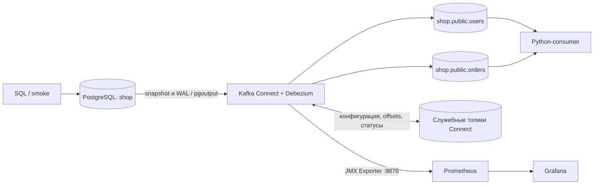
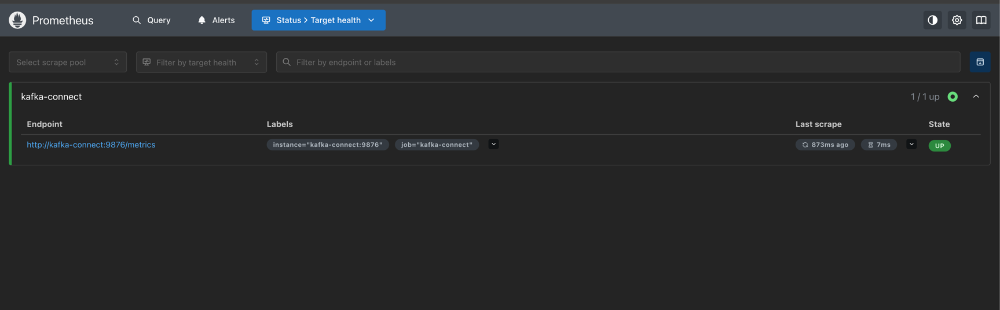
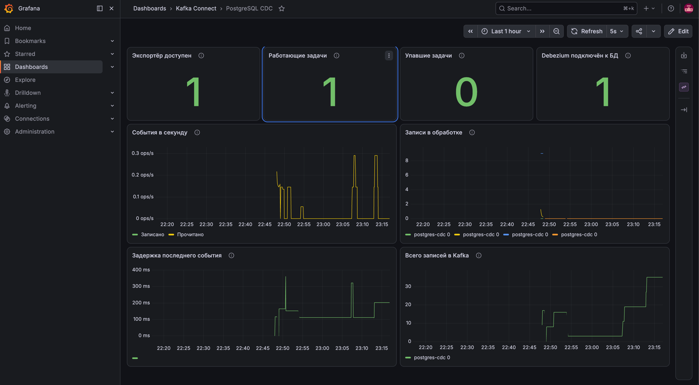

# Практическая работа 5: PostgreSQL CDC с Debezium

Локальный учебный стенд по [заданию](practical_work_5.md): изменения **только** таблиц `users` и `orders`
попадают из PostgreSQL в Kafka. Python-consumer выводит исходные события Debezium в терминал,
Prometheus собирает метрики Kafka Connect, Grafana показывает состояние и передачу данных.

## Быстрый запуск

Нужны запущенный Docker с Compose v2+ (v5 также подходит), GNU Make
и [uv](https://docs.astral.sh/uv/getting-started/installation/).
Python 3.12 и зависимости устанавливаются через uv в локальную `.venv`; версии зависимостей закреплены в `uv.lock`.
Команды выполняются из корня репозитория. При первой сборке нужен интернет для образов и Java/Python-зависимостей.

```bash
make up                           # сборка, запуск, регистрация Debezium
make status                       # connector и task 0 должны быть RUNNING
make smoke ARGS=--snapshot        # 9 начальных строк + INSERT/UPDATE/DELETE + мониторинг
make consume                      # обе таблицы с начала истории, выход Ctrl+C
```

Обычный повторяемый прогон: `make smoke`. Он сам запускает стенд, не удаляя данные.
Без `--snapshot` тест не зависит от сохранности старых snapshot-записей.
Успешный результат: `PASS: CDC обеих таблиц, Prometheus и Grafana` и код выхода 0.

Открыть [дашборд PostgreSQL CDC](http://localhost:3000/d/postgres-cdc) — логин и пароль `admin` / `admin`.
Если Grafana предлагает смену учебного пароля, можно выбрать **Skip**: smoke использует эти реквизиты.
Источник данных и восемь панелей создаются автоматически, импорт JSON вручную не требуется.

Для просмотра Kafka через веб-интерфейс:

```bash
make ui                           # опциональный Kafka UI на localhost:8080
```

## Архитектура



| Компонент                       | Версия           | Назначение                                            |
|---------------------------------|------------------|-------------------------------------------------------|
| `confluentinc/cp-kafka`         | `8.3.1`          | Один брокер и контроллер KRaft, без ZooKeeper         |
| `confluentinc/cp-kafka-connect` | `8.3.1`          | Один distributed worker, REST API, сохранение offsets |
| Debezium PostgreSQL             | `3.5.2.Final`    | Snapshot и чтение логической репликации               |
| `postgres`                      | `17.11-bookworm` | Таблицы, WAL, publication и replication slot          |
| JMX Exporter                    | `1.5.0`          | Java-агент внутри JVM Connect                         |
| `prom/prometheus`               | `v3.13.1`        | Сбор метрик каждые 5 секунд, хранение 7 дней          |
| `grafana/grafana`               | `13.1.2`         | Готовый дашборд состояния и передачи записей          |
| `ghcr.io/kafbat/kafka-ui`       | `v1.5.0`         | Опциональный просмотр топиков и Connect               |

Основой служат практики уроков 5 (Debezium) и 4 (метрики) из заметок модуля курса.
Образ Connect собирается в два этапа: UBI `9.8` загружает плагин и JMX-агент и готовит curl для healthcheck;
runtime запускается штатным `appuser`. Обычный PostgreSQL уже содержит `pgoutput`.

### Адреса и данные

| Сервис       | С хоста                                                  | Внутри Compose       |
|--------------|----------------------------------------------------------|----------------------|
| Kafka        | `localhost:19092`                                        | `kafka:29092`        |
| PostgreSQL   | `localhost:15432`                                        | `postgres:5432`      |
| Connect      | [localhost:8083](http://localhost:8083)                  | `kafka-connect:8083` |
| JMX Exporter | [localhost:9876/metrics](http://localhost:9876/metrics)  | `kafka-connect:9876` |
| Prometheus   | [localhost:9090](http://localhost:9090)                  | `prometheus:9090`    |
| Grafana      | [localhost:3000](http://localhost:3000)                  | `grafana:3000`       |
| Kafka UI     | [localhost:8080](http://localhost:8080), после `make ui` | `kafka-ui:8080`      |

Все опубликованные порты привязаны к `127.0.0.1`. Consumer использует IPv4, соответствующий этой привязке.
Адрес `localhost` внутри контейнера указывает на сам контейнер: Connect подключается к `kafka` и `postgres` по DNS
Compose.

База — `shop`, учебный администратор — `postgres-user` / `postgres-pw`.
Debezium подключается отдельной ролью `debezium` / `debezium-pw`, без superuser, с правами репликации и чтения двух
таблиц.
Это учебные реквизиты для локального стенда без TLS и аутентификации Kafka.

Тома `kafka_data`, `postgres_data`, `prometheus_data`, `grafana_data` принадлежат проекту `kafka-practice-5`.
Kafka хранит события и служебные топики `practice-5-connect-*`; PostgreSQL — данные, WAL и слот.
Остановка через `make down` сохраняет всё это состояние.

## Настройки Debezium

Полный файл: [connectors/postgres.json](connectors/postgres.json).
Схемы, исходные четыре пользователя и пять заказов: [postgres/init.sql](postgres/init.sql).
SQL-инициализация выполняется **только при создании пустого тома PostgreSQL**.

| Настройка                     | Значение и смысл                                                                             |
|-------------------------------|----------------------------------------------------------------------------------------------|
| Имя коннектора                | `postgres-cdc`                                                                               |
| `tasks.max`                   | `1`: один PostgreSQL-коннектор читает источник одной задачей                                 |
| `database.dbname`             | `shop`                                                                                       |
| `plugin.name`                 | `pgoutput`                                                                                   |
| `table.include.list`          | `public\.users,public\.orders`; точки экранированы как regex, в JSON косая черта удваивается |
| `publication.name`            | `practice5_publication`, заранее создана только для двух таблиц                              |
| `publication.autocreate.mode` | `disabled`: коннектор не расширяет publication                                               |
| `slot.name`                   | `practice5_shop`, сохраняется между перезапусками                                            |
| `snapshot.mode`               | `initial`: при первом старте читает существующие строки, затем WAL                           |
| `topic.prefix`                | `shop`: топики `shop.public.users` и `shop.public.orders`                                    |
| Конвертеры                    | `JsonConverter`, `schemas.enable=false` для ключа и значения                                 |
| `tombstones.on.delete`        | `true`: после события удаления передаётся запись с `value=null`                              |

На сервере включены `wal_level=logical`, `max_wal_senders=4`, `max_replication_slots=4`.
`REPLICA IDENTITY FULL` у обеих таблиц позволяет показать полный `before` при обновлении и удалении, увеличивая объём
WAL.
Топики данных имеют одну партицию и replication factor 1; Connect создаёт их явно через механизм topic creation.
Автосоздание топиков брокером отключено. Политика хранения обычная (`delete`), compaction не включена.

`make register` отправляет объект настроек через `PUT /connectors/postgres-cdc/config` и ждёт `RUNNING`
у коннектора и его единственной задачи. Повторный вызов обновляет тот же коннектор и не сбрасывает source offsets.

### Как читать события

Consumer печатает одну JSON-строку на Kafka-запись: `topic`, `partition`, `offset`, `key`, `value`.
Ключ имеет вид `{"id": 1}`. В значении остаётся исходный конверт Debezium, без unwrap или маскирования.

| `value.op`    | Операция           | `before`                  | `after`            |
|---------------|--------------------|---------------------------|--------------------|
| `r`           | Начальный snapshot | `null`                    | Прочитанная строка |
| `c`           | INSERT             | `null`                    | Новая строка       |
| `u`           | UPDATE             | Предыдущая строка         | Новая строка       |
| `d`           | DELETE             | Удалённая строка          | `null`             |
| Нет поля `op` | Tombstone          | Весь `value` равен `null` | —                  |

`TIMESTAMP` без часового пояса передаётся по стандартным правилам Debezium как число микросекунд от эпохи;
исходная JSON-схема в этом стенде не передаётся. В `source` находятся таблица, LSN и другие метаданные.
Tombstone сам по себе не удаляет историю топика и не включает compaction.

## Ручная проверка

В первом терминале:

```bash
make consume
# Или ограниченный просмотр:
make consume ARGS='--limit 9 --timeout 30'
```

Каждый запуск читает с начала доступной истории, не коммитит consumer offsets и не влияет на позицию Debezium.
В другом терминале откройте `make sql` и выполните SQL по шагам, наблюдая события:

```sql
INSERT INTO users (name, email)
VALUES ('Practice user', 'practice@example.test')
RETURNING id AS uid
\gset

INSERT INTO orders (user_id, product_name, quantity)
VALUES (:uid, 'Practice product', 2)
RETURNING id AS oid
\gset

UPDATE users
SET name = 'Practice user updated'
WHERE id = :uid;
UPDATE orders
SET quantity = 3
WHERE id = :oid;

DELETE
FROM orders
WHERE id = :oid;
DELETE
FROM users
WHERE id = :uid;
```

`\gset` сохраняет выданные SERIAL идентификаторы в переменные psql: пример не зависит от предыдущих smoke-прогонов.
Заказ удаляется раньше пользователя из-за внешнего ключа. Выход из psql — `\q`.

### Что проверяет smoke

1. `RUNNING` у коннектора и задачи, streaming-соединение Debezium, точный фильтр таблиц и состав publication.
2. С `--snapshot` — содержимое девяти исходных `r`-событий. Эта проверка рассчитана на историю, созданную данным
   init.sql.
3. Фиксирует конечные offsets до изменений и создаёт свои строки с уникальным маркером.
4. Проверяет `c/u/d` и tombstone обеих таблиц, ключи, `source.table`, содержимое `before`/`after`.
5. Проверяет метрики Prometheus, включая рост числа записей минимум на восемь, dashboard и работоспособность datasource
   Grafana.

Повторы доставки допустимы; общего порядка между двумя топиками тест не требует.
Ожидания ограничены (по умолчанию 120 секунд на этап, параметр `--timeout`). Ошибка завершает CLI ненулевым кодом,
печатает этап, недостающие события и статус Connect. В `finally` удаляются только строки текущего прогона.
История Kafka остаётся доступной для изучения. SERIAL после прогонов продолжает расти — это нормально.
Не запускайте несколько smoke-тестов одновременно и не перезапускайте Connect посреди обычного smoke.

## Мониторинг

Конфигурации находятся в `kafka-connect/kafka-connect.yml`, `prometheus/` и `grafana/`.
В [Prometheus Targets](http://localhost:9090/targets) цель `kafka-connect:9876` должна быть `UP`.





| Панель                      | Метрика / выражение                                                                                      | Ожидание                              |
|-----------------------------|----------------------------------------------------------------------------------------------------------|---------------------------------------|
| Экспортёр доступен          | `up{job="kafka-connect"}`                                                                                | 1                                     |
| Работающие задачи           | `kafka_connect_connector_running_task_count`                                                             | 1                                     |
| Упавшие задачи              | `kafka_connect_connector_failed_task_count`                                                              | 0                                     |
| Debezium подключён к БД     | `debezium_connected`                                                                                     | 1                                     |
| События в секунду           | `rate(kafka_connect_source_record_poll_total[1m])` и `rate(kafka_connect_source_record_write_total[1m])` | Всплеск во время изменений            |
| Записи в обработке          | `kafka_connect_source_record_active_count`                                                               | Обычно возвращается к 0               |
| Задержка последнего события | `debezium_milliseconds_behind_source`                                                                    | Задержка обработки последнего события |
| Всего записей в Kafka       | `kafka_connect_source_record_write_total`                                                                | Растёт при изменениях                 |

Dashboard фильтрует серии по `connector="postgres-cdc"` или `server="shop"`.
`up=1` означает только успешный сбор метрик, поэтому состояние CDC показано отдельными панелями.
Отсутствующие серии отображаются как «Нет данных». Счётчики сбрасываются при перезапуске задачи;
`rate` учитывает сбросы. В число записей входят snapshot и tombstone, поэтому оно не равно числу SQL-команд.
Для `rate` нужны минимум два scrape: сразу после запуска подождите 10–15 секунд.

`active-count` показывает записи внутри Connect, а не весь накопленный WAL.
Задержка Debezium — разница времени последнего события и его обработки, а не полная задержка до consumer;
при простое она не обязана расти. Пара быстрых изменений даёт короткий всплеск — выберите диапазон «Last 5 minutes».

## Перезапуск и очистка

Для опыта с восстановлением оставьте consumer запущенным, остановите только worker,
добавьте строку через `make sql`, затем запустите worker:

```bash
docker compose stop kafka-connect
# В другом терминале: make sql, затем INSERT и COMMIT, если использовали BEGIN.
docker compose start kafka-connect
make status
```

Дождитесь `RUNNING`: созданная во время остановки строка должна прийти как `c`.
Обычный перезапуск продолжает чтение со source offset, а не создаёт новый snapshot.
Если статус ещё недоступен, повторите `make status` после готовности worker.

```bash
make down                         # остановка с сохранением томов
make up                           # продолжение работы

# Полностью удалить учебные данные данного проекта и начать заново:
make reset
make smoke ARGS=--snapshot
```

Слот удерживает WAL, пока коннектор не подтвердил продвижение. Посмотреть состояние через `make sql`:

```sql
SELECT slot_name,
       active,
       restart_lsn,
       confirmed_flush_lsn,
       pg_size_pretty(pg_wal_lsn_diff(pg_current_wal_lsn(), restart_lsn)) AS retained_wal
FROM pg_replication_slots;
```

Удаление слота или служебных offsets не является обычным способом перезапуска.
Доставка рассматривается как **at least once**: при сбоях возможны повторы.
Порядок сохраняется внутри партиции; атомарного применения транзакции сразу в двух Kafka-топиках consumer не получает.
Стенд использует один брокер, поэтому отказоустойчивость к потере брокера не предусмотрена.

## Команды и структура

`make help` перечисляет все команды. Для доступа к CLI напрямую: `uv run --locked kafka-practice --help`.
В PyCharm используйте интерпретатор `.venv/bin/python`.

```text
docker-compose.yaml        сервисы, сеть, тома и healthcheck
Makefile                   команды запуска и проверки
connectors/postgres.json    конфигурация Debezium
postgres/init.sql          схема, тестовые данные, права и publication
kafka-connect/             Dockerfile и JMX-правила
prometheus/                scrape-конфигурация
grafana/                   provisioning и dashboard
src/kafka_practice/         Typer CLI, consumer, smoke, общие адреса
pyproject.toml, uv.lock     Python-зависимости
```

### Диагностика

- **Порт занят:** остановите другой учебный стенд, использующий порты из таблицы. Новый проект имеет отдельные тома,
  но номера портов могут совпадать с уроками курса.
- **Docker недоступен:** запустите Docker Desktop и проверьте `docker info`.
- **Задача FAILED:** `make status`, затем `make logs ARGS='--since 5m kafka-connect'`.
  Проверьте publication, права, слот и `SHOW wal_level;` в psql.
- **После изменения init.sql ничего не изменилось:** init-скрипт не выполняется на существующем томе.
  Для полного повторения практики используйте явно разрушающий `make reset`.
- **Нет событий:** проверьте COMMIT, статус задачи и топики. Статус RUNNING сам по себе не доказывает передачу данных.
- **Нет графиков:** сначала проверьте `/metrics` и Targets, затем datasource Grafana. JMX-правила включены в образ:
  после их изменения выполните `make up`, чтобы пересобрать Connect.
- **Smoke не может проверить Grafana после смены пароля:** учебные реквизиты smoke и Compose должны совпадать;
  переменные Grafana не меняют пароль уже существующего пользователя в томе.

## Проверка решения

Проверено на macOS ARM64 с Docker Compose v5 и Python 3.12:

- сборка Connect и готовность всех пяти основных сервисов;
- исходные 9 snapshot-событий и полный цикл `c/u/d` + tombstone обеих таблиц;
- повторяемый smoke без очистки томов;
- восстановление после остановки Connect: запись, созданная во время простоя, доставлена как `c`, без нового snapshot;
- исключение посторонней тестовой таблицы и ненулевой код `status` при недоступном worker;
- реальные JMX-серии, рост счётчиков в Prometheus, provisioning dashboard и health datasource через API Grafana;
- все PromQL-выражения восьми панелей возвращают данные, Kafka UI подключается к брокеру со статусом `ONLINE`;
- синтаксис Compose и конфигурация Prometheus через `promtool`.

Интерфейс Grafana: скриншот дашборда приведён в разделе «Мониторинг».

## Доп Документация

- [Debezium PostgreSQL 3.5](https://debezium.io/documentation/reference/3.5/connectors/postgresql.html)
- [Метрики Kafka Connect](https://docs.confluent.io/platform/current/connect/monitoring.html)
- [Prometheus JMX Exporter 1.5](https://prometheus.github.io/jmx_exporter/1.5.0/java-agent/)
- [PostgreSQL 17: logical replication](https://www.postgresql.org/docs/17/logical-replication.html)
- [uv: lock и sync](https://docs.astral.sh/uv/concepts/projects/sync/)
